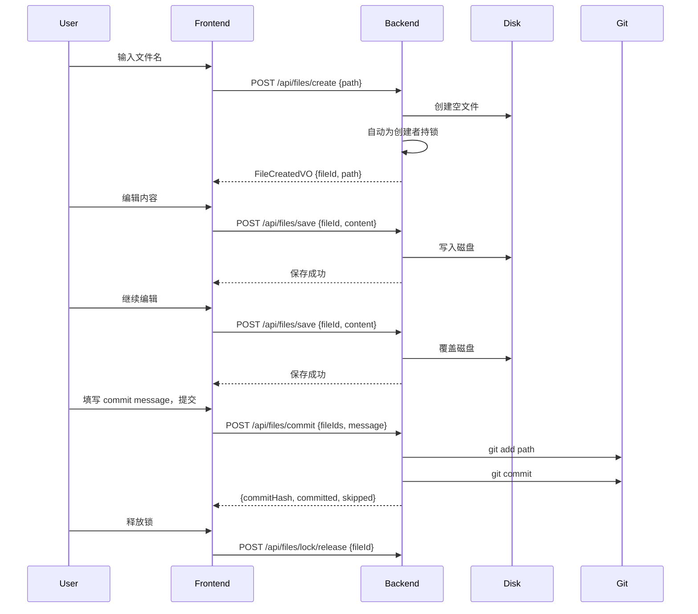
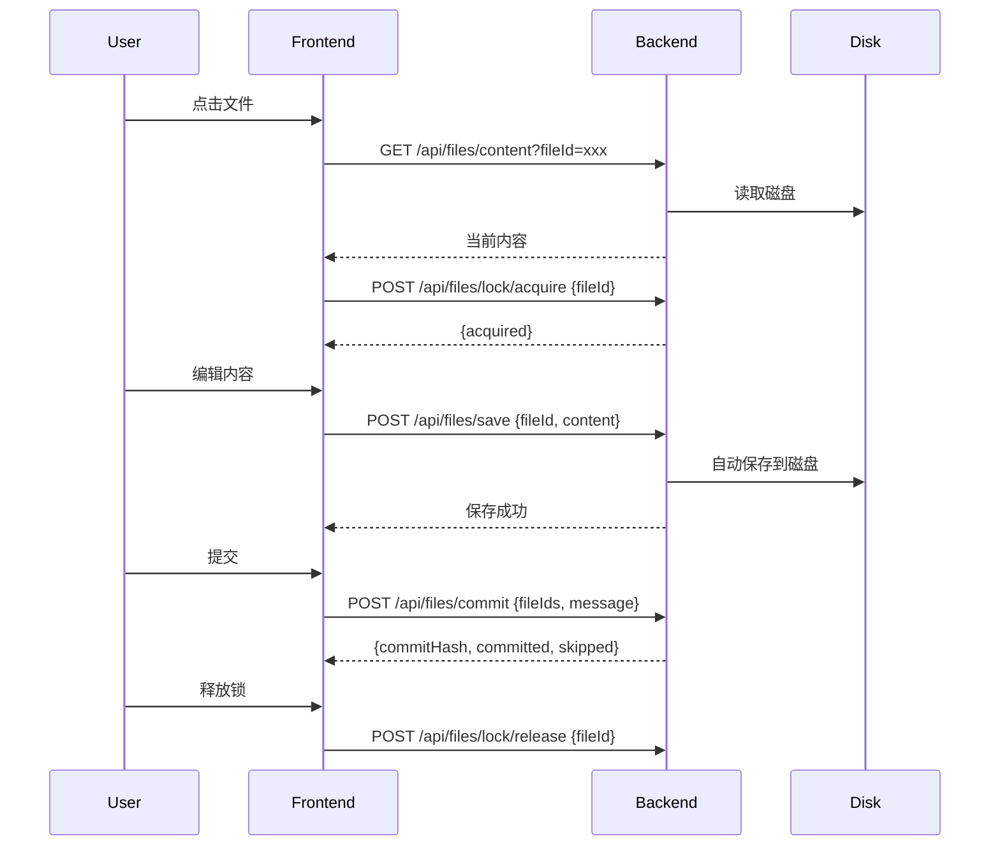
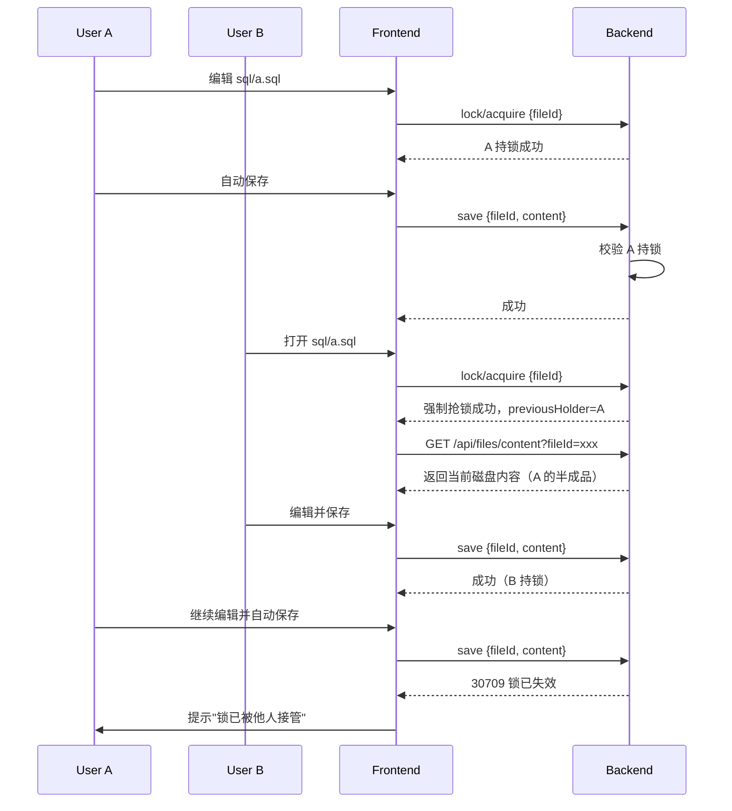
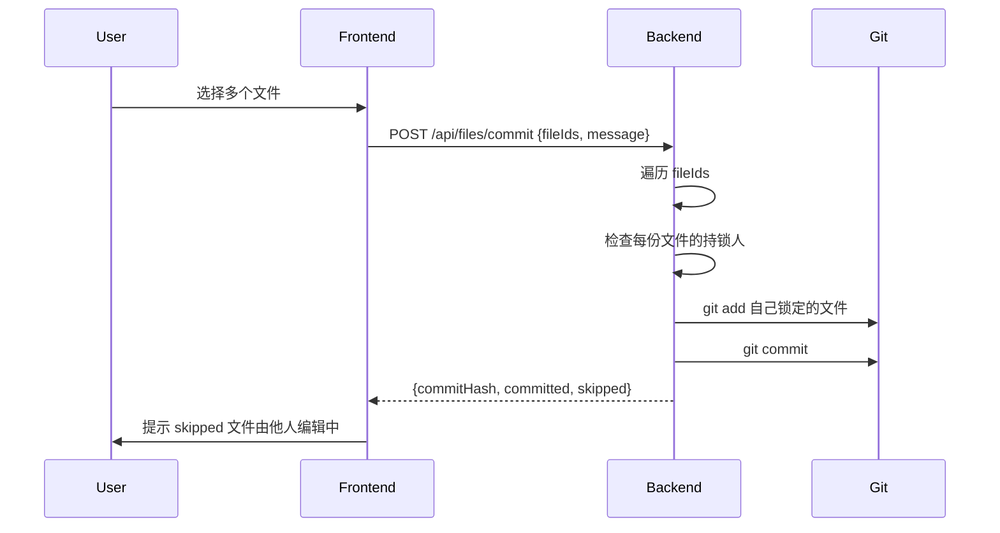
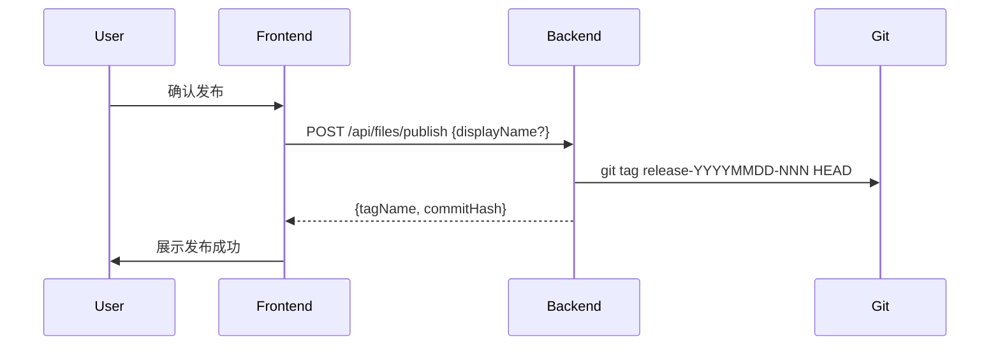
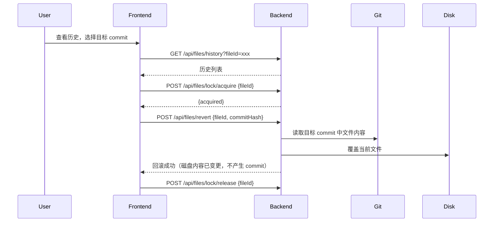
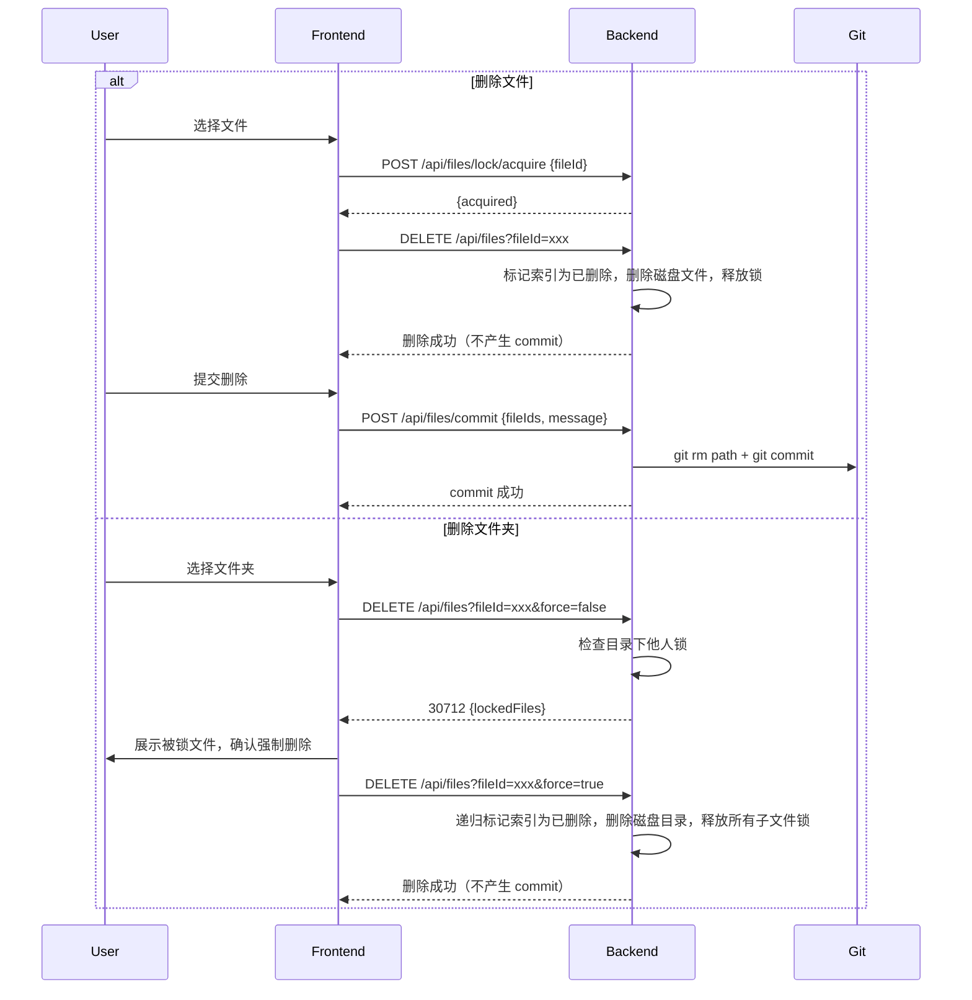
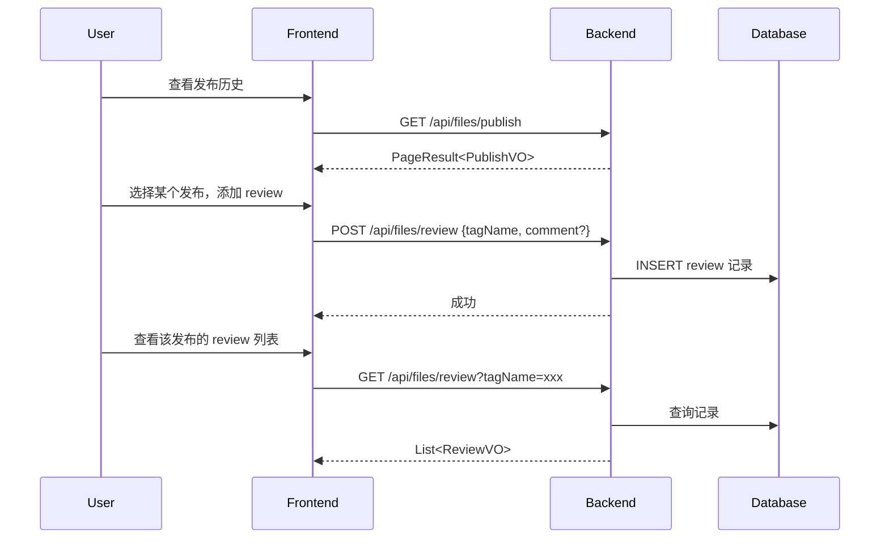

# 文件系统模块设计规范

## 背景

文件系统基于 Git 仓库实现，不使用数据库模拟目录树。每个工作空间对应一个本地 Git 仓库，
所有文件的内容、目录结构、版本历史都存在 Git 里。

社区版固定使用 `default` 工作空间，用户不感知工作空间概念，接口不暴露 `workspaceId` 参数。
工作空间根路径运行时从 `lanting_workspace` 表的 `git_path` 字段读取；首次创建 `default` 工作空间时，
基于配置项 `lanting.data.workspace-dir` 生成路径（默认 `./data/workspaces/default`），再持久化到表中。
不硬编码为代码常量。

**核心依赖**：JGit（已在 pom.xml 中引入）

---

## 目录结构（强制约定）

```
default/
├── .lanting/              ← 系统配置，用户不可见，所有通用文件接口跳过此目录
├── ddl/                   ← Flink CREATE TABLE DDL，前端独立展示
├── sql/                  ← SQL 作业脚本，前端主编辑区
└── docs/                  ← 文档、运维记录、规范，独立入口
```

`ddl/`、`sql/`、`docs/` 三个目录是前端功能的路径依赖：
- `ddl/` 和 `sql/` 对应前端编辑器的两栏布局
- `docs/` 对应独立的文档入口

用户偏好按用户隔离，保存在 `lanting_user.preferences` 字段中；工作空间配置按工作空间隔离，保存在 `lanting_workspace.config` 字段中。两者均不存于 `.lanting/` 目录。

`.lanting/` 目录规则：
- 文件树接口不返回此目录及其内容
- 通用文件读写接口拒绝操作此目录下的路径
- 该目录下文件不由 `/api/lanting/*` 接口管理，用户偏好和工作空间配置已分别迁移到用户/工作空间模块接口

---

## 文件约束

| 约束项 | 规则 |
|---|---|
| 允许的文件类型 | `.sql`、`.md`、`.html`、`.json`、`.ddl` |
| 文件大小上限 | 1MB |
| 路径安全 | 拒绝非法路径，具体规则见「路径规范」设计原则 |
| 禁止操作的路径 | `.lanting/` 目录及其所有子路径 |

---

## 核心概念

### 自动保存 vs 提交

| 操作 | 触发时机 | 行为 | Git 影响 |
|---|---|---|---|
| 自动保存 | 前端定时/内容有变化时 | 只写磁盘文件 | 不 commit |
| 提交 | 用户主动触发 | 批量选择文件，填写 message | 产生一次 commit |
| 释放文件锁 | 用户关闭编辑器或主动释放 | 无特殊操作 | 不触发 commit |

- 自动保存只保证当前磁盘内容是最新的，不产生版本历史。
- 提交是用户明确的"保存版本"意图，commit 历史里每一条都应是有意义的节点。
- 磁盘上的未提交变更会一直保留，下一个人抢锁时能看到。

### 文件锁

- 同一文件、同一时刻只允许一个人持有编辑锁。
- 锁是"软锁"：不阻止他人强制抢锁，只记录当前持锁人。他人抢锁成功后，原持锁人再次编辑
  或自动保存会因锁失效而失败（返回 30709）。
- 持锁期间才能进行编辑并触发自动保存；释放锁后停止自动保存，但已写磁盘内容保留。
- 创建文件（`POST /api/files/create`）成功后自动为创建者持锁，符合"谁创建，谁持有"的语义。
- 任何变更操作都必须先抢锁：编辑文件、回滚文件、删除文件。
- 锁 = "我正在负责这个文件" 的语义。提交时只提交调用方已锁定的文件；被他人锁定的文件
  静默跳过，不阻断提交，通过返回值 skipped 告知调用方。
- 锁只保证并发编辑安全，不保证提交状态，与 commit 完全解耦。
- 锁信息在内存中维护，记录当前持锁人，供前端展示。
- 锁操作与"持锁后执行写动作"通过固定大小的 stripe 锁数组（32 把锁）互斥：同一文件路径的
  抢锁、释放、自动保存等操作串行执行，避免"B 已抢锁打开文件，A 的迟到写入仍落盘"导致的内容不一致；
  不同路径可能命中不同 stripe 实现并行，也可能因 hash 碰撞串行，但不影响正确性。
- 锁状态不持久化，服务重启后清空，符合会话级语义。

### 锁的生命周期

```
                用户 A 抢锁
                      │
                      ▼
                ┌───────────┐
                │  A 持锁   │  ←── 编辑、自动保存时校验锁归属
                └─────┬─────┘
                      │
            ┌─────────┼─────────┐
            │         │         │
            ▼         │         ▼
        主动释放锁      │    用户 B 强制抢锁
            │         │         │
            │         │         ▼
            │         │   ┌───────────┐
            │         │   │  B 持锁   │
            │         │   └─────┬─────┘
            │         │         │
            │         │         ▼
            │         │    A 的自动保存失败
            │         │    （返回 30709，前端提示）
            │         │
            ▼         ▼
          结束        结束
```

### folder/delete 的锁规则

| 操作 | 是否需要锁 | 规则 |
|---|---|---|
| 创建文件 | 不需要（自动持锁） | `POST /api/files/create` 成功后自动为创建者持锁 |
| 创建文件夹 | 不需要 | 新路径，无并发冲突风险 |
| 删除文件 | 需要 | 必须持有该文件锁才能删除；`force=true` 时强制释放锁并删除 |
| 删除文件夹 | 不递归抢锁 | 默认校验目录下是否有他人持锁文件，有则拒绝并返回列表；传 `force=true` 可强制删除并释放所有子文件锁 |

### 发布

- 发布 = 对当前仓库**已提交状态**打 Git Tag。
- Tag 名即发布 ID，格式：`release-YYYYMMDD-abcdef`（commit hash 前 6 位）。
- 可填写可选的显示名/备注，用于前端展示。
- 发布时磁盘上的未提交变更**不纳入**本次发布，静默忽略。
- 发布不需要等待审批；社区版 CR 是轻量、可选的 review 标记。

### 回滚

- 文件级回滚：读取某个 commit 中该文件的内容，覆盖当前文件，只影响该文件。
- 回滚前必须抢锁，回滚完成后磁盘内容已变更。
- **回滚不自动产生 commit**：只覆盖磁盘文件内容，后续提交由用户自行操作。这样用户可以在回滚后检查内容、继续编辑，再统一提交。
- **不做发布级回滚**：发布后如果需要回退，直接选择上一个 tag 重新部署即可，不需要回滚工作区文件。

### Review

- 任何人可对某个发布点 review，review 后打一个标记；不是强制流程。
- Review 记录使用数据库表存储，便于查询、多人 review、追加备注。

---

## 设计原则

### 锁 = 文件责任的声明

- 文件锁不是"悲观锁"也不是"乐观锁"，而是"当前谁对这份文件负责"的语义声明。
- 锁是"软锁"：不阻止他人强制抢锁，只记录当前持锁人。他人强制抢锁后，原持锁人再次编辑
  或自动保存会因锁失效而失败（返回 30709）。
- 持锁者 = 唯一可以对文件内容进行变更的人（编辑、自动保存、回滚）。
- 锁不拥有文件内容，只拥有"当前变更权"。释放锁后，文件内容保留在磁盘上，但变更权转移。

### 提交的边界

- 提交不是"保存所有我看到的变更"，而是"提交我当前负责的文件"。
- 提交时只提交调用方已锁定的文件。未被锁定的文件（无论是否有磁盘变更、无论是否被他人锁定）都不在本次提交范围内。
- 被他人锁定的文件不会报错，而是静默跳过，通过 `skipped` 返回值告知调用方。
- 这种设计保证：
  - 半成品不会意外进入版本历史；
  - Git author 一定是当前对文件负责的人；
  - 批量提交时不会因某个文件被占用而整体失败。

### 读取的边界

- `GET /api/files/content` 读取的是**磁盘上的当前内容**，包含自动保存但未 commit 的变更。
- 用户打开文件时，看到的是最新编辑状态，而不是最后一次 commit 的版本。
- **读取文件不需要持锁**，任何登录用户都可以查看文件内容；持锁只是写入、回滚、删除等变更操作的前提。
- 读取 Git 中某个历史版本的内容，应通过历史记录接口或文件级 diff 接口，不走 content 接口。

### 路径规范

- 所有接口中的 `path` 均为相对于工作空间根目录的相对路径。
- 服务端统一校验并拒绝以下非法路径：前导 `/`、反斜杠 `\`、空路径、纯 `.`、包含 `..`、连续斜杠等。
- 路径规范在写入、读取、删除、提交、回滚等所有涉及文件路径的接口上统一生效。

### 回滚模式

- **文件级回滚**：精确、单文件、需要调用方先抢锁。读取目标 commit 中该文件的内容覆盖当前文件，只影响该文件。适合"某个文件写坏了，恢复到之前的版本"的场景。
- **不自动 commit**：回滚只覆盖磁盘内容，后续是否提交由用户自行决定。这样用户可以在回滚后检查内容、继续编辑，再统一提交。

---

## 核心用户流程

> 以下从用户视角描述文件系统的主要操作流程，使用时序图（Mermaid）表达。

### 1. 新建文件并编辑



### 2. 编辑已有文件



### 3. 他人抢锁（协作场景）



### 4. 提交版本



### 5. 发布



### 6. 文件级回滚



### 7. 删除文件/文件夹



### 8. Review（社区版）



---

## Git 配置

**Author**：使用当前登录用户的 username，格式 `"{username}" <{username}@lanting.io>`

**Commit message**：

| 操作 | message 格式 |
|---|---|
| 初始化工作空间 | `init: workspace initialized` |
| 提交（多文件） | 用户自定义；默认自动生成 `save: {path1}, {path2}, ...` |
| 创建文件夹 | `mkdir: {path}` |
| 提交删除 | `delete: {path}`（用户手动 commit 已删除文件时生成）|

**Tag 命名**：

- Tag 名：`release-YYYYMMDDHHmmss-abcdef`（时间戳到秒 + 短 commit hash 前 6 位）
- 发布 ID = Tag 名
- 可选显示名保存在发布记录中，不影响 Tag 名

**并发安全**：同一工作空间的文件操作通过 `ReentrantLock` 串行化，防止并发 commit 冲突；文件编辑锁按文件路径单独管理。

---

## 工作空间初始化

应用启动时（`@PostConstruct`）对默认工作空间执行初始化：
- 目录不存在则创建
- 不是 Git 仓库则 `git init`
- 确保 `ddl/`、`sql/`、`docs/` 三个目录存在
- 如果是新初始化的仓库，做一次初始 commit：`init: workspace initialized`，author 为 `system`
- 不预置示例文件
- **不在初始化时建立 DB 索引**：索引由后续写操作（save、createFolder 等）自然建立；
  如需批量建立或修复索引，通过管理接口 `POST /api/admin/fs/reconcile` 手动触发。

---

## 接口清单

### 通用文件操作

```
GET    /api/files/tree?parentPath={path}&sort={name|mtime}
       返回：List<FileTreeNode>
       说明：按层级返回子节点（DB 索引查询），不递归；节点包含当前锁定状态
            （lockedBy / lockedAt），供前端展示协作编辑状态。parentPath 为空字符串
            表示根层级，展开文件夹时传入文件夹路径获取子层级，前端按需懒加载。
            sort 参数可选：name（字母顺序）、mtime（索引表 mtime 倒序），默认为 name。

GET    /api/files/content?fileId={fileId}
       返回：文件内容字符串
       说明：读取磁盘上当前文件内容（包含自动保存但未 commit 的变更）。**读取不需要持锁**，
            任何登录用户都可查看。fileId 为 DB 索引中的文件 ID。
            读取 Git 中某个历史版本的内容应通过 `GET /api/files/history` 的 diff 信息或文件级 diff 接口。

POST   /api/files/create
       body：{ path }
       返回：FileCreatedVO { fileId, path }
       说明：创建空文件，只写磁盘空文件 + DB INSERT，不产生 commit。创建成功后自动为
            当前用户持锁，符合"谁创建，谁持有"语义。

POST   /api/files/save
       body：{ fileId, content }
       说明：自动保存，只写磁盘，不 commit；服务端强制校验调用方持有该文件锁。
            路径校验拒绝前导 `/`、反斜杠、空路径、纯 `.` 和 `..` 等非法路径。

POST   /api/files/folder
       body：{ path }
       说明：创建文件夹，目录结构写入 DB 索引，不产生 git commit（空目录 Git 不追踪）。
            创建新路径，不需要抢锁。

DELETE /api/files?fileId={fileId}&force={false}
       返回：无 / 错误时返回 Result<DeleteLockedVO>
       说明：删除文件或文件夹（递归）。删除文件时必须持有该文件锁；删除文件夹时默认校验
            目录下是否有他人持锁文件，有则拒绝（错误码 30712）并返回被锁文件列表，可传
            `force=true` 强制删除。删除操作**不产生 git commit**；删除的提交由用户后续
            通过 `/api/files/commit` 手动触发。

POST   /api/files/commit
       body：{ fileIds: List<Long>, message }
       返回：Result<CommitResultVO>
       说明：批量提交选中的文件。只提交当前调用方已锁定的文件；被他人锁定的文件
            静默跳过，不阻断本次提交。返回值中 committed 为实际提交的文件，skipped
            为被跳过的文件，commitHash 为本次产生的 commit SHA（committed 为空时为空）。
            对于已软删除的文件，commit 会执行 `git rm` 将删除写入 Git。
            如果 `fileIds` 为空或所有文件都被跳过导致 `committed` 为空，返回错误码 30713
            （无可提交的文件），前端可提示用户"没有你持有的文件可以提交"。

GET    /api/files/history?fileId={fileId}&pageNum={pageNum}&pageSize={pageSize}
       返回：PageResult<FileHistoryVO>
       说明：返回指定文件的 commit 历史。fileId 为必填参数。采用游标分页，`total` 与 `totalPages`
            固定返回 -1，通过 `hasMore` 判断是否有下一页。pageNum 从 1 开始，pageSize 默认 10，
            最大 100，复用 PageQuery 基类。

GET    /api/files/diff?fileId={fileId}&from={hash}&to={hash}
       返回：unified diff 格式字符串
       说明：对比文件在两个 commit 之间的差异。`from` 和 `to` 均为必填，任一缺失返回 400。

POST   /api/files/revert
       body：{ fileId, commitHash }
       说明：文件级回滚，读取指定 commit 中该文件内容覆盖当前文件，不自动产生 commit；
            后续由用户自行提交。服务端强制校验调用方持有该文件锁。
```

### 文件锁

```
POST   /api/files/lock/acquire
       body：{ fileId }
       返回：AcquireLockVO { acquired: true, previousHolder?: String, previousHolderAt?: Long }
       说明：抢锁。锁是软锁，即使当前有人持锁也可强制抢锁成功。返回 previousHolder
            告知前端上一个持锁人信息，前端可提示"此文件之前由 xxx 编辑，已接管"。
            调用方已持锁时再次调用，幂等成功并刷新 `lockedAt`；原持锁人再次编辑或
            自动保存会返回 30709。

POST   /api/files/lock/release
       body：{ fileId }
       说明：释放锁，不触发 commit。只有当前持锁人自己可以释放；他人调用返回
            `CommonResultCode.FORBIDDEN`（20002）。
```

### 发布

```
POST   /api/files/publish
       body：{ displayName? }
       返回：{ tagName, commitHash }
       说明：对当前 `HEAD` 已提交状态打 Tag，发布 ID 即 tagName。返回的 `commitHash` 是
            当前 `HEAD` 的 SHA，不包含未提交磁盘变更。

GET    /api/files/publish?pageNum={pageNum}&pageSize={pageSize}
       返回：PageResult<PublishVO>
       说明：查询所有发布历史，按发布时间倒序排列。pageNum 从 1 开始，pageSize 默认 10，
            最大 100，复用 PageQuery 基类。

       说明：不做发布级回滚。发布后如需回退，直接选择上一个 tag 重新部署即可。
```

### Review

```
POST   /api/files/review
       body：{ tagName, comment? }
       说明：对某个发布标记 review

GET    /api/files/review?tagName={tagName}
       返回：List<ReviewVO>
       说明：查询某个发布的 review 记录
```

### 用户偏好

```
GET    /api/users/me/preferences          读取当前用户偏好
PUT    /api/users/me/preferences          保存当前用户偏好（body: JSON 对象）
```
说明：偏好数据保存在 `lanting_user.preferences` 字段，按用户隔离。

### 工作空间配置

```
GET    /api/workspaces/config     读取工作空间配置
PUT    /api/workspaces/config     保存工作空间配置（body: JSON 对象）
```
说明：工作空间配置保存在 `lanting_workspace.config` 字段，按工作空间隔离。

---

## 数据结构

### FileTreeNode

```java
public class FileTreeNode {
    private String name;              // 文件/文件夹名，如 "user_count.sql"
    private String path;              // 相对路径，如 "sql/user_count.sql"
    private String type;              // "file" 或 "folder"
    private String lockedBy;          // 当前持锁人 username，null 表示未被锁定
    private Long lockedAt;            // 抢锁时间戳（毫秒）
    private Long mtime;               // 文件最后修改时间（毫秒），用于 mtime 排序
    private List<FileTreeNode> children;  // folder 时有值，file 时为 null
}
```

说明：文件树接口会查询 DB 索引获取节点列表，并实时查询内存中的锁状态，前端据此展示"正在被谁编辑"的协作状态。

### AcquireLockVO

```java
public class AcquireLockVO {
    private boolean acquired;           // 是否抢锁成功（软锁下恒为 true）
    private String previousHolder;      // 上一个持锁人 username，null 表示之前无人持锁
    private Long previousHolderAt;      // 上一个持锁人抢锁时间戳（毫秒）
}
```

说明：`lock/acquire` 接口返回，用于告知前端是否接管了他人的锁。

### CommitResultVO

```java
public class CommitResultVO {
    private String commitHash;        // 本次 commit SHA，committed 为空时为 null
    private List<String> committed;   // 实际提交的文件列表
    private List<String> skipped;     // 被跳过的文件列表（他人持锁）
}
```

### FileHistoryVO

```java
public class FileHistoryVO {
    private String commitHash;        // commit SHA
    private String message;           // commit message
    private String author;            // 操作人 username
    private Long timestamp;           // commit 时间（毫秒时间戳）
}
```

### PublishVO

```java
public class PublishVO {
    private String tagName;           // 发布 ID，如 "release-20260704-001"
    private String displayName;       // 可选显示名
    private String commitHash;        // 对应 commit SHA
    private Long timestamp;           // 发布时间
}
```

### ReviewVO

```java
public class ReviewVO {
    private String tagName;           // 发布 ID
    private String reviewer;          // reviewer username
    private String comment;           // 备注
    private Long timestamp;           // review 时间
}
```

### LockedFileVO

```java
public class LockedFileVO {
    private String path;               // 文件路径
    private String lockedBy;           // 持锁人 username
}
```

说明：被锁定文件的基础信息，被 `DeleteLockedVO` 复用。

### DeleteLockedVO

```java
public class DeleteLockedVO {
    private List<LockedFileVO> lockedFiles;  // 被他人锁定的文件列表
}
```

### DTO

```java
public class CreateFileDTO { private String path; }
public class SaveFileDTO { private Long fileId; private String content; }
public class CreateFolderDTO { private String path; }
public class CommitFileDTO { private List<Long> fileIds; private String message; }
public class RevertFileDTO { private Long fileId; private String commitHash; }
public class PublishDTO { private String displayName; }
public class ReviewDTO { private String tagName; private String comment; }
public class LockDTO { private Long fileId; }
```

---

## 文件组织

```
module/file/
├── entity/
│   ├── WorkspaceEntity.java
│   ├── PublishEntity.java
│   ├── ReviewEntity.java
│   └── FileIndexEntity.java
├── vo/
│   ├── FileTreeNode.java
│   ├── AcquireLockVO.java
│   ├── CommitResultVO.java
│   ├── FileHistoryVO.java
│   ├── PublishVO.java
│   ├── ReviewVO.java
│   ├── LockedFileVO.java
│   └── DeleteLockedVO.java
├── mapper/
│   ├── WorkspaceMapper.java
│   ├── PublishMapper.java
│   ├── ReviewMapper.java
│   └── FileIndexMapper.java
├── dto/
│   ├── SaveFileDTO.java
│   ├── CreateFolderDTO.java
│   ├── CommitFileDTO.java
│   ├── RevertFileDTO.java
│   ├── PublishDTO.java
│   ├── ReviewDTO.java
│   └── LockDTO.java
├── result/
│   └── FileResultCode.java        ← 码段 30701–30799
├── service/
│   ├── WorkspaceService.java
│   ├── GitFileService.java
│   ├── FileLockService.java
│   ├── FileIndexService.java
│   ├── PublishService.java
│   └── ReviewService.java
└── controller/
    ├── FileController.java
    ├── WorkspaceController.java
    └── FileSystemAdminController.java
```

---

## 数据库表

需在 `V1__init.sql` 中补充以下表：

```sql
-- 发布记录
CREATE TABLE IF NOT EXISTS lanting_file_publish (
    id           INTEGER PRIMARY KEY AUTOINCREMENT,
    tag_name     VARCHAR(100) NOT NULL,
    display_name VARCHAR(200),
    commit_hash  VARCHAR(100) NOT NULL,
    created_by   VARCHAR(100) NOT NULL,
    is_delete    INTEGER      NOT NULL DEFAULT 0,
    create_time  BIGINT       NOT NULL DEFAULT 0,
    update_time  BIGINT       NOT NULL DEFAULT 0,
    UNIQUE (tag_name, is_delete)
);

-- Review 记录
CREATE TABLE IF NOT EXISTS lanting_file_review (
    id          INTEGER PRIMARY KEY AUTOINCREMENT,
    tag_name    VARCHAR(100) NOT NULL,
    reviewer    VARCHAR(100) NOT NULL,
    comment     VARCHAR(500),
    is_delete   INTEGER      NOT NULL DEFAULT 0,
    create_time BIGINT       NOT NULL DEFAULT 0,
    update_time BIGINT       NOT NULL DEFAULT 0
);

-- 文件系统元数据索引表
CREATE TABLE IF NOT EXISTS lanting_file_index (
    id          INTEGER PRIMARY KEY AUTOINCREMENT,
    path        VARCHAR(1000) NOT NULL,
    name        VARCHAR(200)  NOT NULL,
    type        VARCHAR(10)   NOT NULL,             -- file / folder
    parent_path VARCHAR(1000) NOT NULL DEFAULT '',  -- 根目录子节点为空字符串
    mtime       BIGINT        NOT NULL DEFAULT 0,   -- 磁盘文件最后修改时间（毫秒）
    crc32       BIGINT        NOT NULL DEFAULT 0,   -- 文件内容 CRC32 校验和；folder 固定为 0
    deleted_at  BIGINT        NOT NULL DEFAULT 0,   -- 删除时间戳（毫秒），0 表示未删除
    create_time BIGINT        NOT NULL DEFAULT 0,
    update_time BIGINT        NOT NULL DEFAULT 0,
    UNIQUE (path, deleted_at)
);
CREATE INDEX IF NOT EXISTS idx_file_index_parent ON lanting_file_index(parent_path);
```

---

## 错误码（30701–30799）

| 错误码 | 含义 | HTTP 状态 |
|---|---|---|
| 30701 | 工作空间不存在 | 404 |
| 30702 | 文件不存在 | 404 |
| 30703 | 文件类型不允许 | 400 |
| 30704 | 文件大小超过限制（最大 1MB） | 400 |
| 30705 | 路径包含非法字符（路径穿越） | 400 |
| 30706 | 不允许操作 .lanting 目录 | 403 |
| 30707 | 文件已存在 | 400 |
| 30708 | Git 操作失败 | 500 |
| 30709 | 文件已被锁定 | 423 |
| 30710 | 发布 tag 已存在 | 409 |
| 30711 | 回滚目标不存在 | 404 |
| 30712 | 回滚或删除文件夹时部分文件被锁定 | 423 |
| 30713 | 无可提交的文件 | 400 |
| 30714 | 文件内容与索引不一致 | 200 |

---

## 待确认问题

> 以下问题需要在实现前确认，暂不进入实现阶段。

- [x] **是否允许提交被他人锁定的文件**：已确认——不允许直接提交。提交时只提交调用方已锁定的文件；被他人锁定的文件静默跳过，通过返回值 `skipped` 告知调用方。
- [x] **回滚是否自动 commit**：已确认——回滚只覆盖文件内容，不自动产生 commit，后续由用户自行提交。
- [x] **文件锁超时策略**：已确认——不需要心跳和后台定时任务。采用软锁：锁只记录当前持锁人，他人可随时强制抢锁；原持锁人再次编辑或自动保存会失败。
- [x] **save 接口服务端锁校验**：已在接口说明中标注"服务端强制校验调用方持有该文件锁"，实现时需确保未持锁调用返回 30709。
- [x] **文件树排序规则**：已确认——支持两种排序方式，前端通过参数选择：
  1. 按文件/文件夹名字母顺序排序；
  2. 按文件更新时间倒序排序。
  不实现 `original`（原始顺序），因为文件系统目录遍历顺序不稳定，可靠实现成本高。
- [x] **历史记录条数上限**：已确认——不设置硬上限，改用分页。接口 `GET /api/files/history` 支持 `pageNum` 和 `pageSize`，默认 10 条，最大 100 条，返回 `PageResult<FileHistoryVO>`。
- [x] **folder/delete 是否需要抢锁**：已确认——创建文件夹不需要锁；删除文件需要抢锁；删除文件夹不递归抢锁，但默认校验目录下是否有他人持锁文件，有则拒绝，可传 `force=true` 强制删除。
## FAQ

> 以下问题均来自 file 子系统的问题扫描与修复过程，按主题整理，供后续维护者参考。

### Q：Git 写操作为什么要用工作空间级别锁？社区版怎么实现的？

**A**：所有 Git 写操作（`commit`、`delete`、`publish`、`createFolder` 等）都操作同一个本地仓库，并发执行会产生竞争甚至破坏仓库状态。因此需要在工作空间级别串行化。

社区版只支持一个默认工作空间，使用一个单例 `ReentrantLock` 即可；锁的可重入性保证同一线程内嵌套调用安全。

### Q：文件树为什么从 DB 索引查询，而不是直接从磁盘读取？

**A**：虽然社区版文件数通常在几十到几百的量级，直接从磁盘遍历成本可控，但使用 DB 索引（`lanting_file_index` 表）有以下优势：
- 支持按 mtime 排序，无需遍历后排序；
- 节点可直接附带锁状态，避免额外的磁盘 IO；
- 为后续扩展（如按发布 tag 展示历史目录结构）留出空间。
所有写操作（save、createFolder、delete、revert）都会同步更新 DB 索引，通过 `reconcile` 接口可随时校验磁盘与索引的一致性。

### Q：用户偏好和工作空间配置为什么存在数据库，而不是 `.lanting/` 目录下的 JSON 文件？

**A**：按用户/工作空间隔离的配置数据更适合用数据库字段存储：
- 避免磁盘 IO 失败时错误地抛出 `GIT_OPERATION_FAILED` 这类语义不符的异常；
- 配置与工作空间/用户实体生命周期绑定，删除时随逻辑删除一并清理。

对应字段：`lanting_user.preferences`、`lanting_workspace.config`，均标注 `@JsonIgnore`，不通过实体接口对外暴露。

### Q：工作空间根路径是怎么确定的？

**A**：运行时从 `lanting_workspace.git_path` 读取。首次创建 `default` 工作空间时，基于配置项 `lanting.data.workspace-dir` 生成路径（默认 `./data/workspaces/default`），再持久化到表中。

### Q：`lanting_file_publish` 的 `tag_name` 为什么不用单列唯一，而是 `(tag_name, is_delete)` 联合唯一？

**A**：项目统一使用软删除。如果 `tag_name` 单列唯一，删除一个发布后无法再创建同名发布；联合唯一允许删除后重新发布同名 tag，符合“回收站”语义。

### Q：文件级回滚（revert）为什么只覆盖内容不产生 commit？

**A**：revert 只覆盖磁盘文件内容，后续由用户自行提交。这样用户可以在回滚后检查内容是否正确、是否需要继续编辑，再统一提交。如果自动 commit，用户发现回滚结果不对时需要再回滚一次，反而麻烦。

### Q：为什么不做发布级回滚（rollback-release）？

**A**：发布后如果需要回退，直接选择上一个 tag 重新部署即可，不需要回滚工作区文件。发布级回滚的诉求本质上是"回到之前的已发布状态"，而 tag 本身就记录了那个状态，重新部署 tag 就是最直接的方式。

### Q：文件锁是硬锁吗？删除文件夹时他人锁怎么办？

**A**：是**软锁**：不阻止他人强制抢锁，只记录当前持锁人。持锁人再次编辑或自动保存时校验归属，被抢锁后操作失败（返回 30709）。

删除文件夹时：
- 默认校验目录下是否有他人持锁文件，有则拒绝（错误码 30712）；
- 传 `force=true` 时服务端无条件释放目录下所有子文件锁并删除。

### Q：`createdBy` 为什么统一用 username，而不是有的用 user id？

**A**：file 模块中发布记录 (`lanting_file_publish`)、Review 记录 (`lanting_file_review`) 使用 username 表示操作人。`lanting_workspace.created_by` 代码中也写入 username 字符串。

> **已知差异**：`V1__init.sql` 中 `lanting_workspace.created_by` 定义为 `INTEGER`，但代码中实际写入的是 username 字符串（如 `"admin"`）。SQLite 动态类型不会报错，但 schema 与使用不一致。建议后续将 DDL 改为 `VARCHAR(100)`。

### Q：`BusinessException(ResultCode, String)` 的自定义消息为什么前端看不到？如何修复？

**A**：`GlobalExceptionHandler` 原实现只根据 `ResultCode` 和 `args` 解析国际化文案，忽略了 `BusinessException` 构造时传入的自定义 `message`。修复方式是在 `BusinessException` 中增加 `customMessage` 标记，handler 中优先使用自定义消息；无自定义消息时再走 `MessageSource` 国际化。这样既保留了动态异常详情，也不破坏 `BusinessException(ResultCode, Object[])` 的国际化能力。

### Q：事件驱动架构中，file 模块为什么不现在就定义发布/回滚事件？

**A**：遵循“有订阅（Listener）才有事件”的原则。不做没有任何 Listener 的事件，避免空事件噪音。当后续有模块需要监听 file 发布或回滚时，再补充对应事件和 Listener。该原则已写入 `docs/backend/event-driven-architecture-spec.md`。

### Q：`history` 接口的 `path` 参数为空时查什么？为什么默认 `pageSize` 是 10？

**A**：`path` 为必填参数，传入具体文件路径只查该路径历史。`pageSize` 随项目分页基类 `PageQuery` 统一为 10，`history` 采用游标分页，`total` 与 `totalPages` 固定为 -1，前端通过 `hasMore` 判断是否有下一页。


## 自动保存（Auto-Save）时机设计（临时记录）

> 本章为临时记录，记录当前设计下自动保存的边界与潜在问题，供后续迭代参考。

### 当前行为

- 前端在编辑过程中按一定频率触发 `POST /api/files/save`。
- 后端在校验持锁后把内容写入磁盘。
- 只有已经发送到后端的变更才会落盘；未触发 auto-save 的编辑内容只存在于前端内存。
- 自动保存不产生 Git commit，只更新磁盘内容。

### 风险点

当用户 A 在前端编辑但**尚未触发 auto-save** 时：

- 用户 B 可以强制抢同一份文件的锁。
- B 读取到的是磁盘上最近一次 auto-save 的内容，可能不是 A 最新的编辑状态。
- B 保存后，A 未 auto-save 的前端内容虽然没有实际写入磁盘，但从用户视角看相当于“丢失”。
- 后端目前无法感知前端未发送的草稿，这个问题不能仅靠后端的 striped lock 解决。

### 后续设计思路

1. **锁状态变更前强制 save**：在释放锁或他人抢锁前，前端必须先把当前编辑内容 save 到后端，避免草稿滞留在前端。
2. **前端脏状态标记**：后端维护每个文件的“最近活跃编辑时间”，B 抢锁时如果 A 仍在活跃编辑，提示风险或要求确认。
3. **版本号/乐观锁**：每次 save 带一个版本号（如当前文件 checksum 或最后一次 commit hash），后端发现磁盘版本比客户端新时拒绝保存，由前端处理冲突。
4. **更激进的 auto-save**：缩短 auto-save 间隔或按内容变化触发，缩小风险窗口，但不彻底消除风险。

### 待确认

- auto-save 频率是否固定？是否按内容变化触发？
- 是否需要在后端维护“谁在编辑哪个文件”的活跃状态？
- 锁状态变更时，是否必须保证前端草稿已落盘？
- 是否需要引入版本号/乐观锁机制来检测并拒绝覆盖未保存内容？
