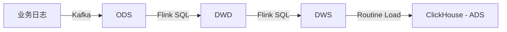

# Data Warehouse Architecture

## Overview

四层实时数仓架构，数据流：Kafka → Flink → Hudi → ClickHouse。

## Layer definitions

### ODS (Operational Data Store)
- Source: Kafka topic 原始日志
- Storage: Hudi COW 表
- Granularity: 全量原始事件
- Retention: 30 天

### DWD (Data Warehouse Detail)
- Source: ODS 层
- Processing: 清洗、去重、维表补齐
- Storage: Hudi COW 表

### DWS (Data Warehouse Summary)
- Source: DWD 层
- Processing: GROUP BY 时间窗口 + 维度
- Storage: Hudi MOR 表（写入优化）

### ADS (Application Data Store)
- Source: DWS 层（离线导出） + Kafka 实时流
- Storage: ClickHouse MergeTree
- Purpose: 报表、大屏、即席查询
